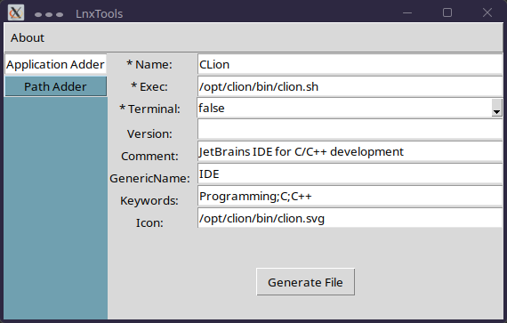
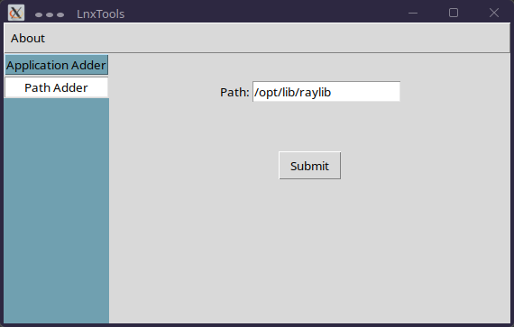

# LnxTools

# Description:

Just a small tool for UNIX based operating systems with two functions yet:

## 1. Application adder:

<b> root privileges required </b>

Adds an existing application to the systems "/usr/share/applications" directory.  
This directory stores .desktop files which are used to launch an application. If you add your  
application to the directory you can call it from terminal and from the overlay which 
spawns when pressing the Windows key.

Currently it is possible to adjust following options when registering an application:
* Name (Name of the executable)
* Exec (Path to the executable)
* Terminal (boolean value which determines if application is run only in terminal)
* Version (Version of application)
* Comment (Comment on what the application does)
* GenericName (Like: IDE, Browser)
* Keywords (Keywords like: Scientific, Gaming, Programming)
* Icon (Path to icon for the application)

## 2. Path adder

This functionality is used to add a new path to the PATH environment variable.
The new added paths are stored in "/home/USERNAME/.custom_path_vars".

# Usage:

To run LnxTools enter the directory and type:
> sudo python3 main.py

# Used libraries

The tool uses TkInter (normally preinstalled) to display the GUI. You can install it via:
> sudo apt install python3-tk
